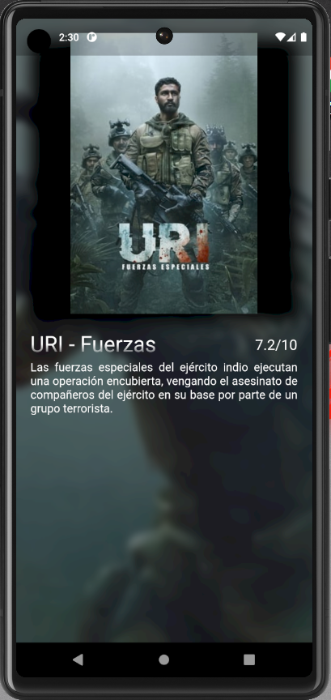

# DMI_PRACTICA12_200749

  
# Universidad Tecnológica de Xicotepec de Juárez

## Ingeniería en Desarrollo y Gestión de Software

## Desarrollo Movil Integral

## Marco Antonio Rosas Gonzalez
 
## 10° "A"

## Septiempre - Diciembre

## Descripción:  Este proyecto representa una aplicación de demostración desarrollada en Flutter que exhibe la página de inicio de la aplicación "MovieApp-200749". La página de inicio incluye los siguientes elementos clave:

Inicio.dart
Dentro de este archivo se encuentra la clase Inicio, que representa la página de inicio de la aplicación. En el método inicializar, se llama a _cargarDatosJSON para obtener información de películas utilizando el manejador HTTP. Además, se define un estilo de fuente personalizado y se establece la estructura fundamental de la aplicación, que consta de una barra superior de navegación (AppBar), un menú lateral (Drawer) y una barra de navegación inferior (BottomNavigationBar).

1. Barra Superior de Navegación (AppBar)
La AppBar muestra el título "MovieApp-200749" en el centro y un ícono de búsqueda en la esquina derecha. Aquí puedes navegar y realizar búsquedas.

2. Menú Deslizante (Drawer)
El menú deslizante se abre deslizando desde el borde izquierdo de la pantalla o tocando el ícono del menú en la AppBar. Contiene las siguientes opciones:

- "Películas": Una opción que muestra películas y aplica un estilo de fuente personalizado al texto.
- "Televisión": Una opción que muestra programas de televisión y utiliza el mismo estilo de fuente personalizado.
- "Cerrar": Una opción que permite cerrar el menú deslizante y regresar a la página de inicio.

3. Barra de Navegación Inferior (BottomNavigationBar)
La barra de navegación inferior incluye tres elementos:

- "Populares": Muestra películas populares y muestra un ícono de pulgar hacia arriba.
- "Próximos Estrenos": Muestra películas próximas a su estreno y utiliza un ícono de actualización.
- "Mejor Valoradas": Muestra películas mejor valoradas y presenta un ícono de estrella.

ListaMultimedia.dart
Dentro de este archivo se define la clase ListaMultimedia, que es un StatefulWidget que representa una lista de contenidos multimedia. Actualmente, en el método generar, retorna un contenedor vacío. Puedes personalizar esta parte para mostrar la lista de contenidos multimedia.

ManejadorHTTP.dart
El archivo ManejadorHTTP.dart contiene la lógica para realizar peticiones HTTP y obtener datos de películas desde una API. Define la clase ManejadorHTTP, que contiene métodos para obtener datos JSON y buscar películas.

Constantes.dart
El archivo Constantes.dart define una constante API_KEY, que se emplea en ManejadorHTTP.dart para autenticar las solicitudes a la API.

La aplicación muestra en el cuerpo principal los pósteres de las películas más populares.

&nbsp;
&nbsp;

&nbsp;
&nbsp;

 
 
